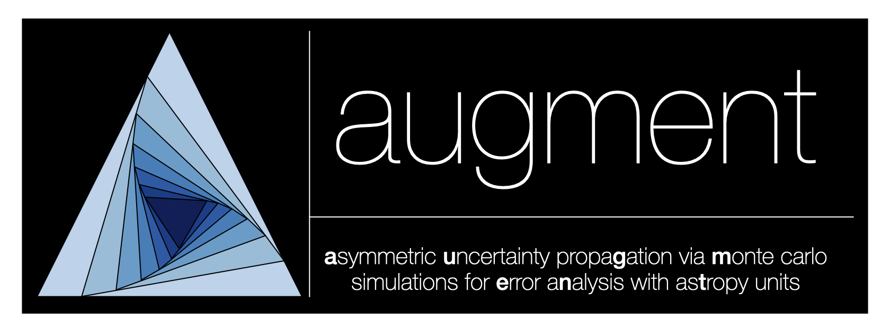

<p align="center">
  
</p>

# augment

`augment` is a small Python package for propagating asymmetric measurement
uncertainties through Astropy-unit-aware Monte Carlo simulations.

The name stands for **A**symmetric **U**ncertainty propa**G**ation via
**M**onte Carlo simulations for **E**rror a**N**alysis with as**T**ropy units.

## Features

- Register input variables with central values, asymmetric errors, units, and optional bounds.
- Draw samples from split-normal, normal, or lognormal distributions.
- Run unit-aware model functions on sampled quantities.
- Summarize outputs with median, 16th, and 84th percentiles.
- Compute rank-correlation error budgets with Spearman rho.
- Format asymmetric values for reports, tables, and notebooks.
- Plot posterior histograms, ECDF/CCDF curves, and corner plots.
- Load variable specifications from JSON or CSV and export results.

## Installation

For development from a local checkout:

```bash
python -m venv .venv
source .venv/bin/activate
pip install -e .[dev]
```

To include documentation dependencies:

```bash
pip install -e .[dev,docs]
```

## Quickstart

```python
import numpy as np
from astropy import constants as const
from astropy import units as u

from augment import Sampler, format_summary_table


sampler = Sampler(n_samples=100_000, seed=42)

sampler.add(
    "temperature",
    5772 * u.K,
    upper_error=80 * u.K,
    lower_error=60 * u.K,
    lower=0 * u.K,
)

sampler.add(
    "radius",
    1.0 * u.solRad,
    upper_error=0.08 * u.solRad,
    lower_error=0.05 * u.solRad,
    lower=0 * u.solRad,
)


def stefan_boltzmann(temperature, radius):
    flux = const.sigma_sb * temperature**4
    luminosity = 4 * np.pi * radius**2 * flux

    return {
        "flux": flux.to(u.W / u.m**2),
        "luminosity": luminosity.to(u.W),
    }


out = sampler.run(
    stefan_boltzmann,
    return_samples=True,
    error_budget_against="luminosity",
)

print(format_summary_table(
    out,
    keys=("luminosity", "flux"),
    tablefmt="plain",
))
```

## How The Sampler Works

`Sampler` stores each uncertain input as a `VariableSpec`. Each variable has a
name, central value, upper error, lower error, unit, optional bounds, and a
sampling distribution. When `sampler.run(...)` is called, `augment` draws one
sample array for every registered variable, passes those arrays into your model
function, and summarizes each returned output.

The model can return a single Astropy `Quantity` or a dictionary of named
quantities:

```python
def model(temperature, radius):
    return {
        "flux": const.sigma_sb * temperature**4,
        "luminosity": 4 * np.pi * radius**2 * const.sigma_sb * temperature**4,
    }
```

Set `return_samples=True` if you want to keep the full output sample arrays for
plotting or custom post-processing. Set `error_budget_against="output_name"` to
compute Spearman rank correlations between each input variable and that output.

### Distributions

Each variable can choose a distribution with the `dist` argument:

- `"split_normal"`: the default. Draws a two-piece normal distribution in
  linear space, using `lower_error` below the central value and `upper_error`
  above it. This is useful for asymmetric measurement uncertainties.
- `"normal"`: draws a symmetric normal distribution in linear space, using the
  average of the upper and lower errors as the standard deviation.
- `"lognormal"`: draws in log space and returns positive samples. This is useful
  for quantities that are strictly positive and better described by fractional
  scatter.

Bounds can be supplied with `lower=` and `upper=`. For example, `lower=0 * u.K`
prevents unphysical negative temperatures.

### Formatted Summaries And `f`

`format_summary(...)` prints median values with asymmetric 16th/84th percentile
errors. In log-space summaries, `augment` drops non-positive samples before
taking `log10`.

When `include_fraction=True`, the formatted string can include an `f` value:

```text
[f: 3.42%]
```

This is the percentage of finite samples that were non-positive before any
positive-only or log-space filtering. It is a diagnostic: if `f` is large, the
log-space summary is describing only the positive part of the sample
distribution, not the full distribution.

## Plotting

`augment` includes plotting helpers for inspecting output samples:

```python
import matplotlib.pyplot as plt

from augment import plot_posterior


fig, ax = plt.subplots()
plot_posterior(
    out,
    key="luminosity",
    log10=True,
    ax=ax,
    pretty_label=r"Luminosity",
)

fig, ax = plt.subplots()
plot_posterior(
    out,
    key="flux",
    log10=True,
    ax=ax,
    pretty_label=r"Flux",
)

plt.show()
```

For multi-parameter views, use `plot_corner`:

```python
from augment import plot_corner


fig = plot_corner(
    out,
    keys=("flux", "luminosity"),
    log_keys=("flux", "luminosity"),
    label_map={
        "flux": r"Flux",
        "luminosity": r"Luminosity",
    },
)
```

## Consistent Masks And Summaries

For workflows where plots and printed values must use exactly the same subset
of samples, create an active mask once and reuse it:

```python
from augment import set_active_mask, get_active_mask, format_summary


set_active_mask(
    out,
    keys=("flux", "luminosity"),
    log_keys=("flux", "luminosity"),
)

mask = get_active_mask(out)

print(
    format_summary(
        out["summary"]["luminosity"],
        samples=out["samples"]["luminosity"],
        mask=mask,
        logspace=True,
    )
)
```

This is useful for log-space plots because non-positive samples must be excluded
before applying `log10`.

## Loading Specifications

Variable specifications can be loaded from JSON or CSV:

```python
from augment import Sampler, load_specs_json


sampler = Sampler(n_samples=100_000, seed=42)
load_specs_json("variables.json", sampler=sampler)
```

Example JSON:

```json
[
  {
    "name": "temperature",
    "central_value": 5772,
    "central_unit": "K",
    "upper_error": 80,
    "lower_error": 60,
    "error_unit": "K",
    "lower_bound": 0.0
  },
  {
    "name": "radius",
    "central_value": 1.0,
    "central_unit": "solRad",
    "upper_error": 0.08,
    "lower_error": 0.05,
    "error_unit": "solRad",
    "lower_bound": 0.0
  }
]
```

## Development

Run the test suite:

```bash
pytest
```

Format the code:

```bash
black .
```

Build the documentation locally:

```bash
sphinx-build -b html docs docs/_build/html
```

## License

`augment` is distributed under the MIT license. See `LICENSE` for details.

## Acknowledgments

This package was developed with assistance from ChatGPT for code developement, documentation drafting, testing workflows, and package-structure review. Final design decisions, scientific use-cases, validation, and maintenance are the responsibility of the package author.